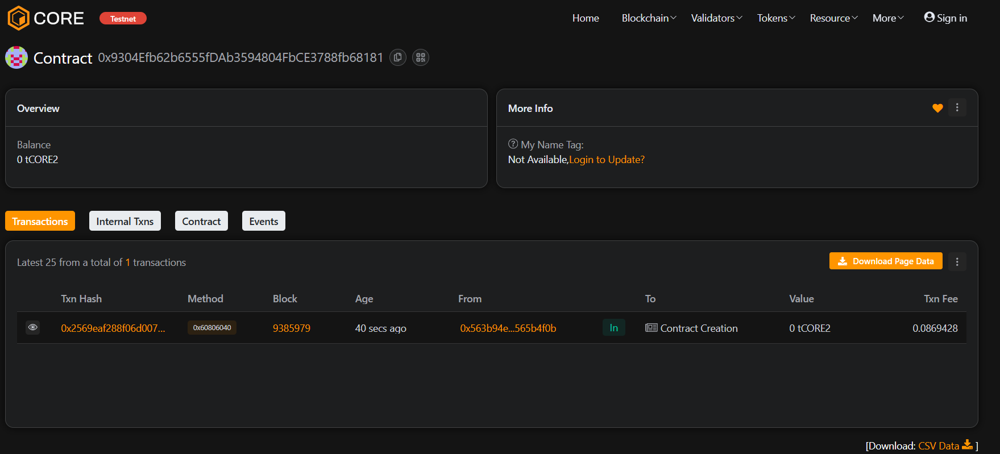

# ⚛️ QuantumLedger

## 🧩 Project Description
QuantumLedger is a decentralized ledger system designed to securely record, store, and retrieve digital data on the blockchain. Each entry is timestamped, immutable, and transparent — ensuring full traceability and trust.

---

## 🌐 Project Vision
To revolutionize data integrity and verification using blockchain technology, enabling organizations and individuals to store tamper-proof records with maximum transparency and security.

---

## ⚙️ Key Features
- Add and manage records securely on-chain  
- Retrieve record details with timestamp and author  
- Owner-only access to modify or update records  
- Transparent and verifiable ledger for all entries  

---

## 🚀 Future Scope
- Integration with off-chain data oracles  
- Support for IPFS-based document storage  
- Multi-signature owner control  
- Cross-chain record verification system  
- AI-powered analytics for record insights  

---

## 🧰 Tech Stack
- **Solidity** — Smart contract language  
- **Hardhat** — Ethereum development environment  
- **JavaScript** — Testing & deployment scripting  
- **Ethereum Blockchain** — Immutable storage layer  

---

## 📜 License
This project is licensed under the **MIT License**.

contract add : 0x9304Efb62b6555fDAb3594804FbCE3788fb68181
